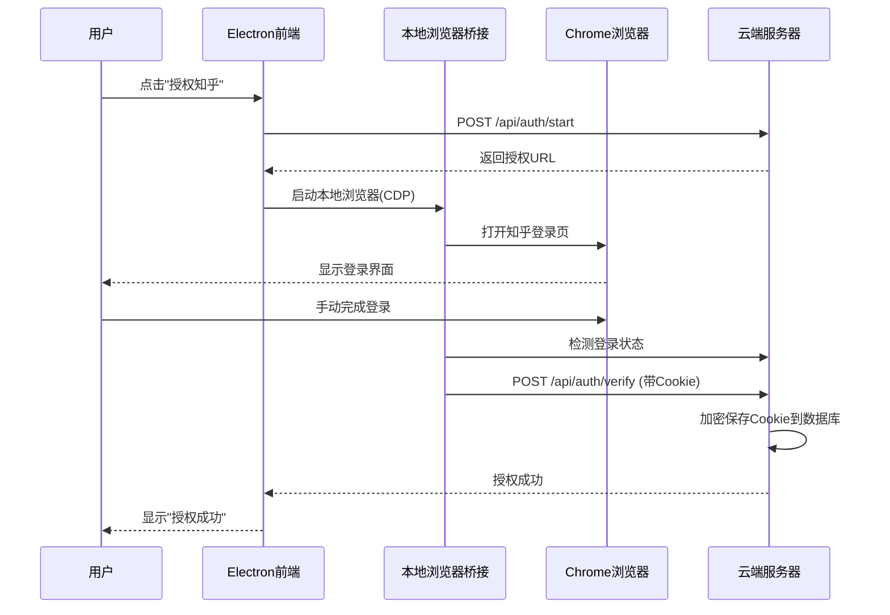
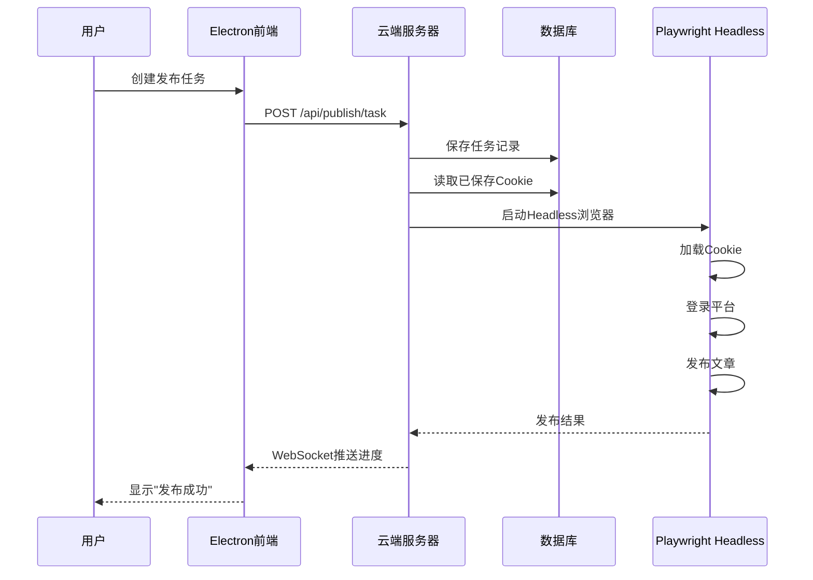

# Auto_GEO 混合架构分工说明

> **版本**: v3.1.0
> **更新日期**: 2026-03-05
> **架构模式**: Hybrid（混合部署）

## 概述

Auto_GEO 采用混合架构设计，将**用户交互**（授权）和**自动化执行**（发布）分离到不同的环境中执行。

```
┌─────────────────────┐         ┌─────────────────────┐
│   Electron 本地     │ ◄──────► │    云端服务器       │
│   (控制终端)        │   API   │    (执行核心)       │
└─────────────────────┘         └─────────────────────┘
        │                               │
        │                               │
    本地浏览器                        Headless浏览器
    (GUI授权)                        (自动化执行)
```

---

## 一、云端服务器（执行核心）

### 1.1 核心服务

| 服务 | 说明 | 端口/路径 |
|------|------|----------|
| **FastAPI 后端** | 所有 API 端点、业务逻辑 | 8001 |
| **SQLite 数据库** | 持久化存储 | `backend/database/auto_geo_v3.db` |
| **Playwright** | Headless 浏览器自动化 | - |
| **定时任务调度器** | APScheduler 定时执行 | - |
| **WebSocket** | 实时进度推送 | `ws://host:8001/ws` |

### 1.2 数据存储

```
backend/
├── database/
│   └── auto_geo_v3.db          # SQLite 数据库
│       ├── 用户/项目/关键词       # 业务数据
│       ├── 文章和发布记录         # 内容数据
│       └── 加密Cookie/会话       # 登录会话
└── static/
    └── uploads/                 # 静态文件
        └── *.jpg,*.png          # 上传的图片
```

### 1.3 云端负责的任务

| 任务类型 | 说明 | 浏览器模式 |
|---------|------|----------|
| **文章自动发布** | 读取已保存Cookie，自动发布文章 | Headless |
| **收录检测** | AI平台搜索检测 | Headless |
| **定时任务** | 定期执行自动化操作 | Headless |
| **数据API** | 提供数据查询接口 | - |

---

## 二、Electron 本地（控制终端）

### 2.1 核心组件

| 组件 | 文件路径 | 说明 |
|------|----------|------|
| **主进程** | `electron/main/index.ts` | 应用入口，管理窗口和进程 |
| **浏览器桥接管理器** | `electron/main/browser-bridge-manager.ts` | 启动/监控本地浏览器 |
| **IPC 通信** | `electron/main/ipc-handlers.ts` | 主进程与渲染进程通信 |
| **预加载脚本** | `electron/preload/index.ts` | 安全暴露API给渲染进程 |

### 2.2 本地负责的任务

| 任务 | 说明 | 是否持久化 |
|------|------|----------|
| **账号授权** | 打开本地浏览器完成登录 | ❌ Cookie存云端 |
| **文章编辑** | 富文本编辑器界面 | ❌ 文章存云端 |
| **任务管理** | 创建/查看发布任务 | ❌ 任务存云端 |
| **桥接服务控制** | 启动/重启本地浏览器 | ❌ 进程级状态 |

### 2.3 无持久化存储

> **重要**: Electron 本地不存储任何业务数据！所有数据都在云端数据库。

```
┌─────────────────────────────────────────────────────────┐
│                  Electron 本地                          │
│  ❌ 不存储业务数据                                        │
│  ❌ 不存储 Cookie                                        │
│  ❌ 不存储文章内容                                        │
│  ✅ 仅运行浏览器桥接服务 (进程级)                          │
│  ✅ 仅提供用户界面 (Vue3)                                 │
└─────────────────────────────────────────────────────────┘
```

---

## 三、工作流程

### 3.1 账号授权流程（混合模式）



### 3.2 自动发布流程（云端执行）



---

## 四、数据流向

### 4.1 授权时数据流向

```
┌──────────────┐    ┌──────────────┐    ┌──────────────┐
│  Electron    │    │  本地浏览器   │    │  云端服务器   │
│              │    │   (Chrome)    │    │              │
└──────┬───────┘    └──────┬───────┘    └──────┬───────┘
       │                   │                   │
       │ 1. 打开登录页      │                   │
       │◄──────────────────┤                   │
       │                   │                   │
       │ 2. 用户手动登录    │                   │
       │                   │                   │
       │ 3. 获取Cookie      │                   │
       │──────────────────────────────────────▶│
       │                   │                   │
       │                   │              4. 加密存储
       │                   │                   │
       │ 5. 授权成功        │                   │
       │◄──────────────────────────────────────┤
```

### 4.2 发布时数据流向

```
┌──────────────┐    ┌──────────────┐    ┌──────────────┐
│  Electron    │    │  云端服务器   │    │  Playwright  │
│              │    │              │    │   (Headless) │
└──────┬───────┘    └──────┬───────┘    └──────┬───────┘
       │                   │                   │
       │ 1. 创建发布任务    │                   │
       │──────────────────▶│                   │
       │                   │                   │
       │                   │ 2. 读取Cookie     │
       │                   │◄────数据库────────┤
       │                   │                   │
       │                   │ 3. 加载Cookie     │
       │                   │──────────────────▶│
       │                   │                   │
       │                   │              4. 发布文章
       │                   │                   │
       │ 5. 进度推送        │                   │
       │◄──────────────────┤◄──────────────────┤
```

---

## 五、配置说明

### 5.1 部署模式配置

环境变量 `DEPLOYMENT_MODE` 决定架构行为：

| 模式 | 授权 | 发布 | 适用场景 |
|------|------|------|----------|
| **local** | 本地GUI | 本地GUI | 开发/调试 |
| **cloud** | 预存会话 | Headless | 纯自动化 |
| **hybrid** ⭐ | 本地GUI | Headless | 生产环境 |

### 5.2 环境变量

```bash
# 部署模式
DEPLOYMENT_MODE=hybrid

# 强制Headless（可选）
HEADLESS_MODE=false

# 本地浏览器CDP端口
LOCAL_BROWSER_CDP_PORT=9222
```

### 5.3 Electron 端配置

Electron 应用启动时自动启动浏览器桥接服务，无需额外配置。

---

## 六、文件路径对照

### 6.1 云端服务器

| 文件/目录 | 说明 |
|----------|------|
| `backend/main.py` | 后端入口 |
| `backend/database/auto_geo_v3.db` | SQLite 数据库 |
| `backend/static/uploads/` | 上传文件 |
| `.cookies/` | Cookie 存储目录（旧版兼容） |

### 6.2 Electron 本地

| 文件/目录 | 说明 |
|----------|------|
| `frontend/electron/main/index.ts` | 主进程入口 |
| `frontend/electron/main/browser-bridge-manager.ts` | 桥接管理器 |
| `frontend/src/views/settings/SettingsPage.vue` | 设置页面（可查看桥接状态） |

---

## 七、故障排查

### 问题1: 授权失败

```
错误: "本地浏览器未运行"
解决: 检查 Electron 设置页面的"本地浏览器桥接服务"状态
```

### 问题2: 发布失败

```
错误: "Cookie已过期"
解决: 重新执行授权流程获取新Cookie
```

### 问题3: 桥接服务启动失败

```
错误: "Python 不可用"
解决: 安装 Python 3.10+ 并确保在PATH中
```

---

## 八、架构优势

| 优势 | 说明 |
|------|------|
| **多设备共用** | Cookie存在云端，多台设备可共用会话 |
| **7x24运行** | 云端服务器持续执行，无需本地设备在线 |
| **安全分离** | 授权在本地完成，Cookie加密存云端 |
| **轻量客户端** | Electron 只做界面，无数据存储负担 |

---

**维护者**: 小a
**文档版本**: v3.1.0
